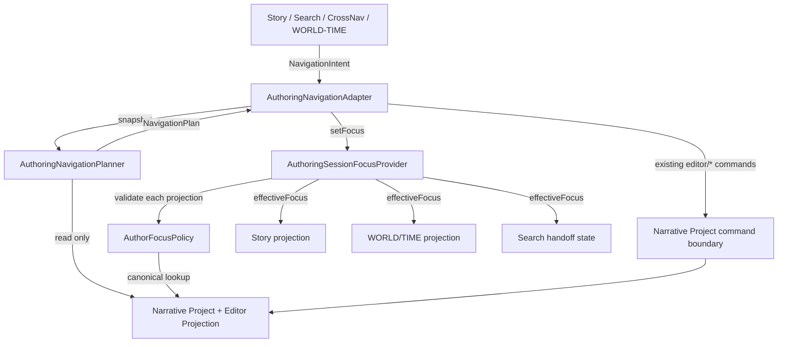

# 93 Days — A67-D1 Workspace Context · Stage 7 Dynamic Flow / Data Flow

Status: **STAGE 7 COMPLETE — Gate to Detailed Design**
Base: `93-days-editor@ba0285295b3727c0518349344560d1577c971172`
Design branch before this document: `design/a67-d1-workspace-context-stage0@b48cd86722daef01443a7c8c8bbca200aba96aea`
Depends on:
- `93DAYS_A67_D1_WORKSPACE_CONTEXT_STAGE0.md`
- `93DAYS_A67_D1_WORKSPACE_CONTEXT_STAGE1_USE_CASES.md`
- `93DAYS_A67_D1_WORKSPACE_CONTEXT_STAGE2_DOMAIN_MODEL.md`
- `93DAYS_A67_D1_WORKSPACE_CONTEXT_STAGE3_ARCHITECTURE_VERIFICATION.md`
- `93DAYS_A67_D1_WORKSPACE_CONTEXT_STAGE4_IMPACT_ANALYSIS.md`
- `93DAYS_A67_D1_WORKSPACE_CONTEXT_STAGE5_COMPONENT_DESIGN.md`
- `93DAYS_A67_D1_WORKSPACE_CONTEXT_STAGE6_CONTRACTS.md`

Change type: **design-only**
Production code in this stage: **none**

---

## 0. Goal / Definition of Done

Stage 7 answers one question:

> Can the Stage 6 contracts be executed end-to-end through the current editor architecture without creating a transient semantic contradiction, hidden runtime mutation, fabricated authored data, or stale-focus resurrection?

Definition of Done:

1. all six required journeys are walked step-by-step;
2. each step names owner, input, validation, mutation, downstream call and result;
3. success and error/degraded paths are explicit;
4. the two Stage 6 review questions are closed:
   - Focus transition vs editor command ordering;
   - delete focused Story → stale clear → Undo;
5. no production implementation is started;
6. if no BLOCKER remains, the next gate is Detailed Design.

---

## 1. Live architecture facts used by this Stage

These are verified against stable `ba0285295b3727c0518349344560d1577c971172`.

### FACT-WC-D7-001 — NarrativeWorkspace is the composition boundary

`NarrativeWorkspace` already owns editor-session presentation state such as Split View and composes:

- `ProjectSearchPanel`;
- `CrossWorkspaceNavigator`;
- `StoryWorkspace`;
- `WorldTimeWorkspace`.

Therefore a session-scoped Focus provider and a thin navigation adapter can be composed here without moving Focus into authored project state.

### FACT-WC-D7-002 — Story selection is currently local and mixes canonical + visual identity

`StoryWorkspace` currently keeps:

```text
selectedStoryEntity =
  Character(id, canvasNodeId)
  | StoryNode(id, canvasNodeId)
  | Item(id, canvasNodeId)
```

The future shared Focus must split this into:

```text
Shared AuthorFocus:
  StoryNode(id)
  | Character(id)

Story-local:
  selectedCanvasNodeId
  selectedLocalItemId
```

### FACT-WC-D7-003 — existing cross-surface navigation is sequential

Current Search, CrossWorkspaceNavigator and WORLD/TIME navigation issue one or more existing editor commands sequentially:

- `editor/setStoryViewport`;
- `editor/setWorldTimeViewport`;
- `editor/selectWorkspace`.

The current reducer applies these synchronously.

### FACT-WC-D7-004 — editor navigation is outside authoring Undo history

`narrativeProjectHistoryReducer` treats `editor/*` commands as editor navigation and updates only `present`; they do not append to authored `past`.

### FACT-WC-D7-005 — authored Undo restores project snapshots while preserving current editor view

`restoreSnapshotKeepingEditorView(...)` restores authored content but keeps current workspace / current viewport semantics.

This is exactly why session Focus must remain independent from authored Undo snapshots.

---

## 2. Stage 7 execution rule: logical transaction, not required render atomicity

A contextual navigation request is one **logical navigation transaction**:

```text
UI intent
  → Planner.plan(snapshot)
  → Adapter validates target
  → Focus transition
  → existing editor navigation commands
  → typed NavigationResult
```

Important: first-slice correctness **must not depend on React batching**.

Why:

- Focus belongs to session state;
- workspace/viewport belong to the existing Narrative Project editor projection;
- these are separate owners;
- future invocations may come from different React scheduling contexts.

Therefore every intermediate render must be semantically safe.

### Safety invariant

```text
Focus identifies canonical authoring subject.
Viewport/workspace only decides where/how that subject is projected.
```

So this intermediate state is valid:

```text
Focus = Story A
workspace = STORY
viewport = old Story viewport
```

and this is also valid:

```text
Focus = Story A
workspace = WORLD/TIME
viewport = old WORLD/TIME viewport
```

The UI may momentarily not show the focused entity in the viewport, but it must never fabricate another entity, time, Canvas node or runtime state.

### Consequence

The Stage 6 order:

```text
set/validate Focus
→ execute existing editor commands
```

is acceptable.

No new atomic command bus or combined project+session reducer is required.

---

## 3. Render-time validity rule

A stored session Focus is not itself proof that the entity still exists.

Every consumer must operate on:

```text
effectiveFocus = validate(project, storedFocus)
```

not blindly on `storedFocus`.

Rules:

- valid canonical entity → project it;
- missing canonical entity → effective Focus is immediately `None`;
- stale raw session Focus must then be permanently cleared by the provider lifecycle;
- UI must never render data from a missing entity by using stale cached copies.

This rule closes the dangerous interval between an authored deletion commit and session-state cleanup.

Implementation mechanism is Stage 8 detail, but the semantic requirement is fixed here.

---

# 4. Flow 1 — Story selected → Show in WORLD/TIME → marker → Story

## Initial state

- Story A exists canonically;
- Story A has authored time;
- Story A has a Story Canvas visual;
- Simulation Playhead = P;
- Author Focus = None or another entity.

## Step 1 — click Story A on Canvas

Owner:
`StoryWorkspace`

Input:
- canonical Story id = A;
- concrete `canvasNodeId`.

Validate:
- Canvas node resolves to canonical Story A.

Mutate:
- shared Focus → `StoryNode(A)`;
- local `selectedCanvasNodeId` → concrete clicked instance;
- local Item inspection cleared if necessary.

Calls:
- Focus provider `setFocus(StoryNode(A))`.

Returns:
- Story inspector projects Story A;
- no editor viewport command required;
- Simulation Playhead unchanged.

## Step 2 — explicit “Show in WORLD/TIME”

Owner:
calling UI → `AuthoringNavigationAdapter`

Input:
`open-story-in-world-time(A)`

Planner reads:
- project;
- current editor state;
- `splitView`.

Validate:
- Story A exists;
- authored temporal placement exists.

Plan:
- Focus target = Story A;
- WORLD/TIME viewport target = A temporal position;
- workspace switch to WORLD/TIME only when not Split View.

Adapter applies:
1. set/confirm Focus A;
2. `editor/setWorldTimeViewport`;
3. if needed `editor/selectWorkspace('world-time')`.

Result:
`navigated`.

Postconditions:
- Focus remains A;
- WORLD/TIME shows the authored time of A;
- Simulation Playhead remains P;
- no authored mutation.

## Step 3 — click Story A marker in WORLD/TIME

Owner:
`WorldTimeWorkspace`

Input:
- Story id A.

Call:
`navigate(open-story-in-story(A))`.

Planner validates:
- canonical Story A exists;
- Story Canvas visual exists.

Plan:
- Focus A;
- Story viewport target derived from existing Canvas visual;
- workspace switch to STORY when not Split View.

Adapter:
1. set/confirm Focus A;
2. `editor/setStoryViewport`;
3. `editor/selectWorkspace('story')` when required.

Result:
`navigated`.

Final:
- Story inspector projects A from shared Focus;
- local concrete instance may be selected only if projection policy resolves an existing visual instance;
- Simulation Playhead remains P.

### Error branch

If A is deleted after marker render but before click:
- Planner re-reads project;
- returns `missing-target`;
- no Focus change to A;
- no workspace/viewport command.

**PASS.**

---

# 5. Flow 2 — Project Search Character → no Canvas instance

## Initial state

- Character C exists canonically;
- C has no Character Canvas visual in current Story canvas;
- Search result C is visible.

## Step 1 — click Search result C

Owner:
`ProjectSearchPanel`

Before navigation:
- push existing local navigation snapshot;
- retain Search-local document identity semantics.

Call:
`navigate(open-search-document(Character C))`.

## Step 2 — Planner

Reads:
- Character C;
- current Story Canvas.

Validate:
- canonical Character C exists.

Projection check:
- no Canvas visual for C.

Plan:
- Focus target = `Character(C)`;
- Story workspace may become destination;
- **no Story viewport command** because there is no concrete visual target;
- no Canvas mutation.

Status:
`canonical-only / no-story-visual`.

## Step 3 — Adapter

Applies:
1. Focus C;
2. optional workspace switch to STORY when not Split View;
3. zero Canvas creation commands.

## Step 4 — StoryWorkspace projection

Reads:
- effective Focus = Character C;
- canonical Character C;
- no matching Canvas instance.

Renders:
- canonical Character inspector;
- no selected visual instance;
- “remove this reference” style instance-specific action disabled/unavailable because no `selectedCanvasNodeId`.

Postconditions:
- C is current Author Focus;
- no Canvas node fabricated;
- Search `activeKey` may remain Search-local;
- no authored/runtime mutation.

### Error branch

If Character C is missing:
- `missing-target`;
- no Focus change;
- no workspace jump to a fake target.

**PASS.**

---

# 6. Flow 3 — Story Focus with no authored time → “Show in time”

## Initial state

- Story A exists;
- Focus = Story A;
- A has no complete authored temporal placement.

## Step 1 — invoke `open-story-in-world-time(A)`

Planner validates:
- A exists;
- temporal target unavailable.

Plan result:
`unavailable / unscheduled-story`.

Focus transition:
- keep/set Story A.

Editor commands:
- **no** `editor/setWorldTimeViewport`;
- **no** `editor/selectWorkspace('world-time')`.

Why:
switching to WORLD/TIME without a representable target would land the author at an unrelated timeline location and would imply context that does not exist.

Postconditions:
- Focus stays A;
- current workspace stays unchanged;
- WORLD/TIME viewport stays unchanged;
- no time invented.

### UI result

Calling UI can disable the action when absence of time is already known.
If data became stale between render and click, typed result explains why navigation did not occur.

**PASS.**

---

# 7. Flow 4 — focused Story deleted → stale Focus cleared → Undo

This is the most important lifecycle flow.

## Initial state

- Story A exists;
- Focus = Story A;
- authored history contains prior snapshot.

## Step 1 — authored delete

Owner:
existing Story authored command path.

Command:
`story/removeNode(A)`.

Reducer:
- removes canonical Story A;
- removes Story connections/references according to existing reducer rules;
- removes matching Story Canvas visual references;
- because this is not `editor/*`, pushes authored history.

Session Focus is **not** part of that authored snapshot.

## Step 2 — first render after project deletion

Input:
- stored session Focus may still physically contain A;
- current project no longer contains A.

Focus provider/policy computes:

```text
validate(projectWithoutA, StoryNode(A))
→ None
```

Therefore:
- consumers receive effective Focus = None;
- no inspector renders deleted Story A;
- no unrelated replacement entity is selected;
- no editor navigation is triggered.

Provider lifecycle then permanently clears the stale stored Focus.

## Step 3 — user invokes Undo

Reducer:
- restores authored snapshot in which Story A exists again;
- keeps current editor navigation view according to existing Undo rules.

Focus provider:
- stored stale Focus has already been cleared;
- effective Focus remains None.

Result:
- Story A exists again canonically;
- Story A may have its restored Canvas representation;
- Author Focus does **not** automatically return to A.

The author must explicitly focus it again.

### Important scheduling note

The contract is about **committed observable deletion**.

If an internal test artificially batches delete and Undo into one state transition so the UI never observes a project snapshot without A, there is no committed stale-focus observation to clear. That is not the user-visible delete → Undo flow and should not be used as the lifecycle acceptance test.

### Required test seam

The provider tests must commit/render the deletion state before Undo is dispatched.

**PASS with Stage 8 requirement:** stale Focus must be read-through validated before projection and then permanently cleared after the committed deletion state is observed.

---

# 8. Flow 5 — Split View → one shared Focus

## Initial state

- `splitView = true`;
- both Story and WORLD/TIME panes are mounted;
- Focus may be None.

## Step 1 — focus Story A in Story pane

Story:
- set shared Focus A;
- local concrete Canvas selection may also change.

WORLD/TIME:
- reads same effective Focus A;
- may highlight/project A only if A has a representable temporal target.

No second Focus exists.

## Step 2 — “Show in time”

Planner sees `splitView = true`.

Plan:
- keep Focus A;
- move WORLD/TIME viewport if A has time;
- omit workspace switch because both panes are already visible.

Story pane remains mounted and keeps local Canvas-instance state.

## Step 3 — click A marker in WORLD/TIME

Plan:
- keep Focus A;
- move Story viewport if visual exists;
- omit workspace switch.

Postconditions:
- exactly one canonical Focus;
- two projections;
- no per-pane Focus;
- Simulation Playhead unchanged.

### Degraded projection

If one pane cannot represent current Focus:
- shared Focus remains;
- that pane shows no projection / canonical-only status as appropriate;
- it must not replace Focus with another entity.

**PASS.**

---

# 9. Flow 6 — Item clicked in Story

## Initial state

- shared Focus = Story A or Character C;
- Item I has a Canvas representation.

## Step — click Item I

Owner:
`StoryWorkspace`.

Input:
- Item I id;
- concrete `canvasNodeId`.

Validate:
- local Item instance exists.

Mutate local only:
- `selectedLocalItemId = I`;
- `selectedCanvasNodeId = concrete item visual`.

Shared Focus:
- unchanged.

Projection:
- local Item inspector may take presentation precedence.

Cross-workspace semantics:
- Search/WORLD-TIME still see prior shared Author Focus.

Why:
Item is intentionally outside first-slice Author Focus. Promoting Item implicitly would expand the domain contract and break Stage 2/6 scope.

**PASS.**

---

# 10. Error / degraded flow matrix

| Condition | Producer | Focus effect | Editor command effect | Result |
|---|---|---|---|---|
| canonical Story missing | Planner/Policy | no new Focus / stale clears | none | `missing-target` |
| canonical Character missing | Planner/Policy | no new Focus / stale clears | none | `missing-target` |
| Character has no Canvas visual | Planner | Character Focus set | optional Story workspace only; no Story viewport | `canonical-only / no-story-visual` |
| Story has no Canvas visual | Planner | Story Focus set | optional Story workspace only; no Story viewport | `canonical-only / no-story-visual` |
| Story has no authored time | Planner | Story Focus set/kept | no WORLD/TIME viewport; no WORLD/TIME switch | `unavailable / unscheduled-story` |
| unsupported Search document | Planner | only resolved supported target may become Focus | existing supported navigation only | typed unsupported/unfocused result |
| stale Focus after project mutation | FocusPolicy/Provider | effective Focus = None; stored stale Focus clears | none | safe no-focus |
| Project Search Back | Search local history | unchanged | restores workspace/viewports only | first-slice intentional limitation |
| empty Story Canvas click | Story local UI | unchanged | none | visual/local selection may clear |
| Item click | Story local UI | unchanged | none | Item local inspection |

---

# 11. Stage 6 review question A — transient React contradiction

Question:

> Can `set Focus → execute workspace/viewport commands` create a transient contradictory render?

Answer:

**No architectural BLOCKER, provided correctness does not rely on batching.**

Reasoning:

1. Focus and viewport encode different dimensions:
   - Focus = canonical authoring subject;
   - viewport/workspace = projection/navigation.
2. A Focus can validly exist while the current viewport does not yet show it.
3. Stage 6 explicitly permits canonical-only Focus.
4. No runtime or authored semantic is inferred from a viewport.
5. Therefore intermediate renders are incomplete projection, not contradictory state.

### Stage 7 decision

Do **not** introduce a new atomic state owner only to make these updates render together.

Do:
- build one deterministic plan from one project/editor snapshot;
- validate before mutation;
- make every intermediate state safe;
- return one typed navigation result.

React batching may improve visual smoothness but is not a correctness dependency.

**QUESTION A: PASS.**

---

# 12. Stage 6 review question B — delete → stale clear → Undo

Question:

> Is `delete focused Story → clear stale Focus → Undo restores Story` correct without automatic Focus resurrection?

Answer:

**Yes, with read-through validation + permanent stale cleanup.**

Required semantics:

```text
project loses A
→ effectiveFocus immediately becomes None
→ stored stale Focus is cleared
→ Undo restores authored A
→ no stored Focus exists to resurrect
→ Focus remains None
```

Focus is session-owned and must never be restored from authored Undo snapshots.

**QUESTION B: PASS.**

---

# 13. Data-flow summary



No reverse dependency from authored reducer to session Focus.

---

# 14. Ordering contract for the Adapter

For a valid intent:

1. capture one current project/editor snapshot;
2. Planner builds a complete plan;
3. if target canonical entity is missing → return without mutation;
4. apply the plan's Focus transition;
5. apply viewport command(s);
6. apply workspace command last when required;
7. return typed result.

Why workspace switch last:

- viewport can be prepared before destination mount/visibility changes;
- Focus already identifies the canonical subject;
- destination appears with the best available projection;
- Split View can simply omit workspace switching.

This is a UX ordering optimization, not a correctness dependency.

---

# 15. No-mutation proof obligations

Every Stage 7 flow must preserve:

- `Simulation Playhead`;
- Actual Presence;
- runtime occurrences;
- runtime Knowledge;
- runtime relationships;
- authored Story content except when Flow 4 intentionally performs authored deletion;
- authored Undo history for Focus itself;
- `project.updatedAt` for Focus itself.

Existing editor viewport/workspace commands may update the editor projection exactly as they do today.

---

# 16. Required Stage 8 tests derived from dynamic flow

## Pure / unit

1. planner: Story → WORLD/TIME success;
2. planner: unscheduled Story;
3. planner: missing Story;
4. planner: Character without Canvas;
5. planner: Split View omits workspace switch;
6. FocusPolicy validates Story/Character;
7. FocusPolicy rejects missing entities.

## Provider/component integration

8. Story click sets canonical Focus while preserving concrete local `canvasNodeId`;
9. Item click leaves shared Focus unchanged;
10. Character Focus renders inspector without Canvas visual;
11. committed Story deletion immediately stops projecting stale Focus;
12. stale stored Focus is permanently cleared;
13. Undo restoring Story does not restore Focus.

## Navigation integration

14. Story → WORLD/TIME → Story preserves Focus and Simulation Playhead;
15. WORLD/TIME marker uses shared adapter, not duplicated local viewport math;
16. Search result handoff sets Focus;
17. Search Back restores only current documented navigation snapshot, not Focus;
18. Split View projects one Focus to both panes.

## Regression

19. current direct Story/WORLD-TIME navigation still works;
20. authoring Undo/Redo remains unchanged;
21. no schema migration;
22. project restart does not promise Focus persistence;
23. Player/Preview/compiler behavior unchanged.

---

# 17. Risks remaining for Detailed Design

### P1 — accidental double source of selection truth

If Story inspector continues reading legacy `selectedStoryEntity` for Story/Character while also reading shared Focus, two canonical selections can diverge.

Stage 8 must define one projection selector and retire canonical Story/Character ownership from the legacy local union.

### P1 — stale cleanup implemented only as cosmetic rendering

It is not enough to hide a stale Focus. The stored stale Focus must be cleared after the missing canonical entity is observed, otherwise later entity restoration could resurrect it.

### P1 — duplicated viewport math survives in callers

Search, CrossWorkspaceNavigator and WORLD/TIME currently contain direct navigation logic. Stage 8 must route the first-slice paths through the shared planner/adapter rather than merely adding Focus writes beside each old implementation.

### P2 — visual instance choice when multiple Character copies exist

Canonical Focus does not choose a specific Canvas copy. Stage 8 must define deterministic display/highlight behavior without writing `canvasNodeId` into shared Focus.

### P2 — error UX

Typed degraded statuses exist. Exact toast/inline-copy presentation can remain minimal in first slice as long as the action never lies or fabricates state.

---

# 18. Gate Review — Dynamic Flow → Detailed Design

✅ All six required flows are executable under Stage 6 contracts.

✅ Focus remains canonical identity only.

✅ Canvas instance remains local presentation identity.

✅ Unscheduled Story does not invent time or switch to unrelated WORLD/TIME position.

✅ Character without Canvas is valid canonical Focus and fabricates no visual node.

✅ Item inspection stays local and does not steal shared Focus.

✅ Split View uses one Focus, not per-pane Focus.

✅ Focus-first + editor-command sequencing is safe without relying on React batching.

✅ Deletion cannot project a stale entity when consumers use validated effective Focus.

✅ Undo remains authored-state restoration and does not restore session Focus.

✅ Existing `editor/*` no-Undo boundary remains reusable.

✅ No schema/runtime/compiler/Player changes are required.

### Gate decision

**✅ PASS to Stage 8 — Detailed Design.**

No P0/P1 architectural BLOCKER remains.

Production implementation still must **not** start until Stage 8 defines exact modules, public TypeScript contracts, projection selectors, lifecycle cleanup mechanism and test seams.
